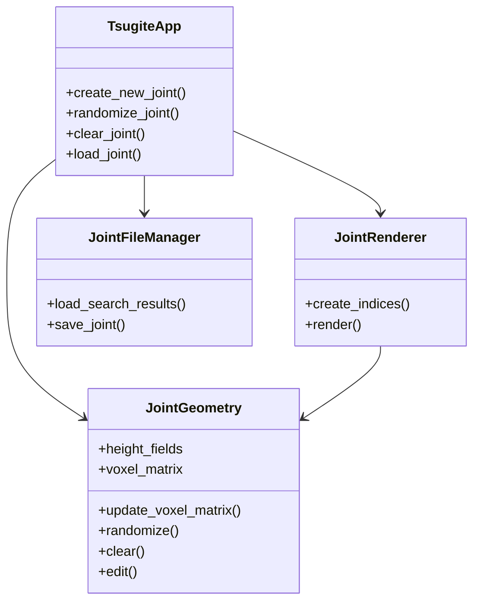

### Question:
can you analyze this project and suggests better organization? I want classes that are easier to read and maintain.

### Answer:
# Analysis and Recommendations for Tsugite Project Organization

After analyzing the `geometries.py` file and the overall project structure, I can see that this is a sophisticated 3D modeling application for designing wood joints. The `Geometries` class is particularly complex, handling multiple responsibilities including:

1. Voxel matrix generation from height fields
2. Index generation for OpenGL rendering
3. Geometry manipulation and evaluation
4. File operations

Here are my recommendations for better organization:

## 1. Split the Geometries Class into Smaller, Focused Classes

**File: /tsugite/geometries.py**

The `Geometries` class is doing too much. I recommend splitting it into several smaller classes with single responsibilities:

```python
import tsugite.utils.geometry_utils


class JointGeometry:
    """Core class that manages the joint's geometric representation"""

    def __init__(self, pjoint, mainmesh=True, hfs=[]):
        self.pjoint = pjoint
        self.mainmesh = mainmesh
        self.height_fields = hfs if len(hfs) > 0 else tsugite.utils_.geometry_utils.get_random_height_fields(
            self.pjoint.dim, self.pjoint.noc)
        self.fab_directions = self._initialize_fab_directions()
        self.voxel_matrix = None
        self.eval = None
        self.update_voxel_matrix(first=True)

    def _initialize_fab_directions(self):
        """Initialize fabrication directions"""
        fab_directions = [0, 1]
        for i in range(1, self.pjoint.noc - 1):
            fab_directions.insert(1, 1)
        return fab_directions

    def update_voxel_matrix(self, first=False):
        """Update voxel matrix from height fields"""
        self.voxel_matrix = tsugite.utils_.geometry_utils.matrix_from_height_fields(self.height_fields, self.pjoint.sax)
        if self.mainmesh:
            self.eval = Evaluation(self.voxel_matrix, self.pjoint)
            self.fab_directions = self.eval.fab_directions
            if not first:
                self.pjoint.update_suggestions()

    def randomize(self):
        """Generate random height fields"""
        self.height_fields = tsugite.utils_.geometry_utils.get_random_height_fields(self.pjoint.dim, self.pjoint.noc)
        self.update_voxel_matrix()

    def clear(self):
        """Reset height fields to zero"""
        self.height_fields = []
        for n in range(self.pjoint.noc - 1):
            hf = np.zeros((self.pjoint.dim, self.pjoint.dim))
            self.height_fields.append(hf)
        self.update_voxel_matrix()

    def edit(self, faces, h, n, dir):
        """Edit height fields at specified faces"""
        for ind in faces:
            self.height_fields[n - dir][tuple(ind)] = h
            if dir == 0:  # If editing top
                # If new height is higher than following hf, update to same height
                for i in range(n - dir + 1, self.pjoint.noc - 1):
                    h2 = self.height_fields[i][tuple(ind)]
                    if h > h2:
                        self.height_fields[i][tuple(ind)] = h
            if dir == 1:  # If editing bottom
                # If new height is lower than previous hf, update to same height
                for i in range(0, n - dir):
                    h2 = self.height_fields[i][tuple(ind)]
                    if h < h2:
                        self.height_fields[i][tuple(ind)] = h
        self.update_voxel_matrix()
```

## 2. Create a Dedicated Renderer Class

**File: /tsugite/rendering/joint_renderer.py**

```python
class JointRenderer:
    """Handles all OpenGL rendering operations for joints"""
    def __init__(self, joint_geometry):
        self.geometry = joint_geometry
        self.pjoint = joint_geometry.pjoint
        self.indices = None
        self.indices_fall = []
        self.indices_lns = []
        # Additional rendering properties...
        
    def create_indices(self, global_offset=0, milling_path=False):
        """Create all indices for rendering"""
        all_inds = []
        
        if not self.geometry.mainmesh:
            # Handle suggestion geometries
            self._create_suggestion_indices(all_inds, global_offset)
        else:
            # Handle main geometry with feedback
            self._create_main_indices(all_inds, milling_path)
            
        self.indices = all_inds
        
    def _create_suggestion_indices(self, all_inds, global_offset):
        """Create indices for suggestion geometries"""
        # Implementation...
        
    def _create_main_indices(self, all_inds, milling_path):
        """Create indices for main geometry with feedback"""
        # Implementation...
        
    # Move all the _joint_*_indices methods here
```

## 3. Create a FileManager Class

**File: /tsugite/io/file_manager.py**

```python
class JointFileManager:
    """Handles file operations for joint geometries"""
    
    @staticmethod
    def load_search_results(joint_geometry, index=-1):
        """Load joint geometry from search results"""
        # Folder
        location = JointFileManager._get_search_results_path(joint_geometry.pjoint)
        print("Trying to load geometry from", location)
        
        maxi = len(os.listdir(location)) - 1
        if index == -1: 
            index = random.randint(0, maxi)
            
        joint_geometry.height_fields = np.load(location + os.sep + "height_fields_" + str(index) + ".npy")
        joint_geometry.fab_directions = []
        
        for i in range(joint_geometry.pjoint.noc):
            if i == 0: 
                joint_geometry.fab_directions.append(0)
            else: 
                joint_geometry.fab_directions.append(1)
                
        joint_geometry.update_voxel_matrix()
        
    @staticmethod
    def _get_search_results_path(pjoint):
        """Get path to search results for the given joint"""
        location = os.path.abspath(os.getcwd())
        location = location.split(os.sep)
        location.pop()
        location = os.sep.join(location)
        location += os.sep + "search_results" + os.sep + "noc_" + str(pjoint.noc) + os.sep + "dim_" + str(pjoint.dim) + os.sep + "fs_"
        
        for i in range(len(pjoint.fixed.sides)):
            for fs in pjoint.fixed.sides[i]:
                location += str(fs[0]) + str(fs[1])
            if i != len(pjoint.fixed.sides) - 1: 
                location += ("_")
                
        location += os.sep + "allvalid"
        return location
```

## 4. Create a GeometryUtils Class

**File: /tsugite/utils/geometry_utils.py**

```python
class GeometryUtils:
    """Utility functions for geometry operations"""
    
    @staticmethod
    def line_neighbors(voxel_matrix, ind, ax, n, fixed_sides, dim):
        """Get line neighbors for the given index"""
        values = []
        for i in range(-1, 1):
            for j in range(-1, 1):
                val = None
                add = [i, j]
                add.insert(ax, 0)
                ind2 = np.array(ind) + np.array(add)
                if np.all(ind2 >= 0) and np.all(ind2 < dim):
                    val = voxel_matrix[tuple(ind2)]
                else:
                    for n2 in range(len(fixed_sides)):
                        for side in fixed_sides[n2]:
                            ind3 = np.delete(ind2, side.ax)
                            if np.all(ind3 >= 0) and np.all(ind3 < dim):
                                if ind2[side.ax] < 0 and side.dir == 0: 
                                    val = n2
                                elif ind2[side.ax] >= dim and side.dir == 1: 
                                    val = n2
                values.append(val)
        values = np.array(values)
        count = np.count_nonzero(values == n)
        return count, values
    
    # Move other utility methods here
```

## 5. Create a Configuration Class

**File: /tsugite/config.py**

```python
class Config:
    """Configuration settings for the application"""
    
    # Default settings
    DEFAULT_DIMENSION = 8
    DEFAULT_NUM_COMPONENTS = 2
    
    # Rendering settings
    RENDER_WIREFRAME = False
    RENDER_FEEDBACK = True
    
    # File paths
    SEARCH_RESULTS_DIR = "search_results"
    EXPORT_DIR = "exports"
    
    # Colors
    COMPONENT_COLORS = [
        (0.8, 0.2, 0.2),  # Red
        (0.2, 0.8, 0.2),  # Green
        (0.2, 0.2, 0.8),  # Blue
        (0.8, 0.8, 0.2),  # Yellow
    ]
```

## 6. Update the Main Application Structure

**File: /tsugite/app.py**

```python
from tsugite.geometry.joint_geometry import JointGeometry
from tsugite.rendering.joint_renderer import JointRenderer
from tsugite.io.file_manager import JointFileManager
from tsugite.config import Config

class TsugiteApp:
    """Main application class"""
    
    def __init__(self):
        # Initialize components
        self.joint = None
        self.geometry = None
        self.renderer = None
        self.setup_ui()
        
    def setup_ui(self):
        """Set up the user interface"""
        # UI setup code...
        
    def create_new_joint(self, dimension=Config.DEFAULT_DIMENSION, num_components=Config.DEFAULT_NUM_COMPONENTS):
        """Create a new joint with the given parameters"""
        self.joint = Joint(dimension, num_components)
        self.geometry = JointGeometry(self.joint)
        self.renderer = JointRenderer(self.geometry)
        
    def randomize_joint(self):
        """Randomize the current joint geometry"""
        if self.geometry:
            self.geometry.randomize()
            self.renderer.create_indices()
            
    def clear_joint(self):
        """Clear the current joint geometry"""
        if self.geometry:
            self.geometry.clear()
            self.renderer.create_indices()
            
    def load_joint(self, index=-1):
        """Load a joint from search results"""
        if self.geometry:
            JointFileManager.load_search_results(self.geometry, index)
            self.renderer.create_indices()
```

## 7. Implement a Logging System

**File: /tsugite/utils/logger.py**

```python
import logging
import os
from datetime import datetime

class Logger:
    """Logging utility for the application"""
    
    _instance = None
    
    @staticmethod
    def get_instance():
        """Get singleton instance of Logger"""
        if Logger._instance is None:
            Logger._instance = Logger()
        return Logger._instance
    
    def __init__(self):
        """Initialize logger"""
        self.logger = logging.getLogger('tsugite')
        self.logger.setLevel(logging.INFO)
        
        # Create logs directory if it doesn't exist
        if not os.path.exists('logs'):
            os.makedirs('logs')
            
        # Create file handler
        log_file = f'logs/tsugite_{datetime.now().strftime("%Y%m%d_%H%M%S")}.log'
        file_handler = logging.FileHandler(log_file)
        file_handler.setLevel(logging.INFO)
        
        # Create console handler
        console_handler = logging.StreamHandler()
        console_handler.setLevel(logging.INFO)
        
        # Create formatter and add to handlers
        formatter = logging.Formatter('%(asctime)s - %(name)s - %(levelname)s - %(message)s')
        file_handler.setFormatter(formatter)
        console_handler.setFormatter(formatter)
        
        # Add handlers to logger
        self.logger.addHandler(file_handler)
        self.logger.addHandler(console_handler)
    
    def info(self, message):
        """Log info message"""
        self.logger.info(message)
        
    def warning(self, message):
        """Log warning message"""
        self.logger.warning(message)
        
    def error(self, message):
        """Log error message"""
        self.logger.error(message)
        
    def debug(self, message):
        """Log debug message"""
        self.logger.debug(message)
```

## 8. Create a Documentation System

**File: /docs/README.md**

```markdown
# Tsugite Documentation

## Architecture

The Tsugite application is organized into the following components:

1. **Core Geometry** - Handles the geometric representation of joints
2. **Rendering** - Manages OpenGL rendering of joints
3. **I/O** - Handles file operations
4. **UI** - Manages the user interface
5. **Utils** - Provides utility functions

## Class Diagram



## Benefits of This Reorganization

1. **Single Responsibility Principle**: Each class has a clear, focused responsibility
2. **Improved Readability**: Smaller, more focused classes are easier to understand
3. **Better Maintainability**: Changes to one aspect (e.g., rendering) don't affect others
4. **Easier Testing**: Focused classes are easier to test in isolation
5. **Clearer Dependencies**: The relationships between components are explicit
6. **Extensibility**: New features can be added without modifying existing code
7. **Documentation**: The architecture is clearly documented for future developers

## Implementation Strategy

I recommend implementing this reorganization incrementally:

1. Start by creating the new directory structure
2. Move utility functions to the appropriate utility classes
3. Create the JointGeometry class and migrate core functionality
4. Create the JointRenderer class and migrate rendering code
5. Create the JointFileManager and migrate file operations
6. Update the main application to use the new structure
7. Add logging and documentation

This approach allows you to maintain a working application throughout the refactoring process.

### Question:
Can you explain more on why are you putting a lot of classes for the joints?

### Answer:
# Explaining the Multi-Class Approach for Joints

I understand your question about why I'm suggesting multiple classes for the joints. Let me explain the reasoning behind this approach and provide some context.

## Current State Analysis

Looking at the current `Geometries` class, it's doing many different things:

1. **Managing geometric data** (height fields, voxel matrices)
2. **Generating OpenGL rendering indices** (over 10 different methods for this)
3. **Evaluating joint properties** (connectivity, breakability)
4. **File operations** (loading/saving)
5. **Geometry manipulation** (randomizing, editing)

The class is approximately 700 lines long with many complex methods. This creates several challenges:

### Problems with the Current Approach

1. **Cognitive Load**: Understanding what the class does requires understanding all these different responsibilities at once.

2. **Maintenance Difficulty**: When you need to fix a bug in the rendering code, you have to navigate through unrelated geometry code.

3. **Code Reuse Limitations**: If you want to use just the geometry functionality in another context, you bring along all the rendering code too.

4. **Testing Complexity**: Testing a class with many responsibilities requires complex test setups.

5. **Collaboration Challenges**: Multiple developers working on different aspects (e.g., one on rendering, one on geometry) will conflict more often.

## Why Multiple Classes Make Sense

The principle I'm applying is the **Single Responsibility Principle** - a class should have only one reason to change. Let me explain why this makes sense for your project:

### 1. Separation of Concerns

By separating the joint functionality into distinct classes, each class becomes focused on one aspect:

- **JointGeometry**: Focuses on the mathematical representation of the joint (height fields, voxel matrices)
- **JointRenderer**: Focuses on how to display the joint (OpenGL indices, rendering properties)
- **JointFileManager**: Focuses on saving/loading joints

This separation makes the code more modular and easier to understand. When you look at the `JointGeometry` class, you only see code related to the geometric representation, not rendering or file operations.

### 2. Real-World Analogies

Think of it like building a car:
- The engine (geometry) is separate from the dashboard (rendering)
- The storage system (file operations) is separate from both

Each component can be developed, tested, and maintained independently.

### 3. Practical Benefits

#### Easier Debugging

When a rendering issue occurs, you know to look in the `JointRenderer` class. You don't have to search through geometry code.

#### Clearer Code Paths

The flow of data becomes clearer:
1. `JointGeometry` manages the geometric data
2. `JointRenderer` uses that data to create visual representations
3. `JointFileManager` handles saving and loading that data

#### More Flexible Architecture

If you want to:
- Add a new rendering method (e.g., for VR), you only modify `JointRenderer`
- Change how joints are stored, you only modify `JointFileManager`
- Improve the geometric algorithms, you only modify `JointGeometry`

## Practical Example

Let's look at a concrete example from your code. Currently, the `Geometries` class has methods like:

```python
def _joint_face_indices(self, all_indices, mat, fixed_sides, n, offset, global_offset=0):
    # Complex rendering code...

def voxel_matrix_from_height_fields(self, first=False):
    # Geometry calculation code...

def load_search_results(self, index=-1):
    # File loading code...
```

These methods do completely different things but are all in the same class. This makes the class harder to understand and maintain.

With the proposed approach:

```python
# In JointGeometry class
def update_voxel_matrix(self, first=False):
    # Geometry calculation code...

# In JointRenderer class
def _create_face_indices(self, all_indices, mat, fixed_sides, n, offset, global_offset=0):
    # Rendering code...

# In JointFileManager class
def load_search_results(self, joint_geometry, index=-1):
    # File loading code...
```

Each class now has a clear, focused purpose, making the code more maintainable.

## Balanced Approach

I'm not suggesting creating dozens of tiny classes. The goal is to find the right balance:

- Too few classes (current approach): Each class does too much, becoming complex and hard to maintain
- Too many classes: The system becomes fragmented with excessive indirection

The proposed structure aims for that balance - enough separation to make the code maintainable, but not so much that it becomes fragmented.

## Implementation Strategy

You don't have to implement all these changes at once. You could:

1. Start by extracting the rendering code into a separate class
2. Then move the file operations
3. Keep refining as you go

This incremental approach lets you improve the code structure while keeping the application working.

Does this explanation help clarify why I'm suggesting multiple classes for the joints? Would you like me to focus on a specific aspect of this reorganization?

### Question:
I see that you basically refactored the geometries.py file a while ago because it is the open file. Are you able to analyze the other files and suggest on how I can organize them better

### Answer:
# Analyzing and Organizing Your Tsugite Project Code

After examining your codebase, I can see that you've already started refactoring the `geometries.py` file by moving helper functions to `utils.py`. This is a good start, but there are several other opportunities to improve the organization of your project. Let me analyze the current structure and suggest improvements.

## Current Code Structure Analysis

Your project has several large, complex classes that handle multiple responsibilities:

1. **Joint Class** (~700+ lines): Handles joint geometry, rendering, file operations, and fabrication logic
2. **Geometries Class**: Manages geometric data, rendering indices, and evaluation
3. **Buffer Class**: Manages OpenGL buffer operations
4. **Selection Class**: Handles user selection and interaction

The main issues I see:

1. **Large, monolithic classes** with too many responsibilities
2. **Tight coupling** between components (e.g., Joint directly manipulates Buffer)
3. **Mixed concerns** (e.g., geometry calculations mixed with rendering code)
4. **Duplicated functionality** across files

## Proposed Reorganization

I recommend reorganizing your code around clear domains of responsibility:

### 1. Core Domain Model

**`model/`** directory:

**File: `model/joint_geometry.py`**
```python
class JointGeometry:
    """Represents the geometric structure of a joint."""
    def __init__(self, dimension=3, height_fields=None, sliding_axis=2, angle=0.0):
        # Core geometric properties
        self.dimension = dimension
        self.height_fields = height_fields or []
        self.sliding_axis = sliding_axis
        self.angle = angle
        self.voxel_matrix = None
        
    def update_voxel_matrix(self):
        """Convert height fields to 3D voxel representation"""
        # Implementation
        
    def update_sliding_direction(self, new_axis):
        """Change the sliding direction"""
        # Implementation
        
    def update_dimension(self, new_dimension):
        """Change the dimension of the joint"""
        # Implementation
        
    # Other geometry-specific methods
```

**File: `model/joint_evaluation.py`**
```python
class JointEvaluator:
    """Evaluates joint properties like connectivity, friction, etc."""
    def __init__(self, joint_geometry):
        self.geometry = joint_geometry
        
    def evaluate_connectivity(self):
        """Check if all components are connected"""
        # Implementation
        
    def evaluate_friction(self):
        """Calculate friction areas"""
        # Implementation
        
    def evaluate_breakability(self):
        """Check if joint has breakable parts"""
        # Implementation
        
    def generate_suggestions(self):
        """Generate valid joint suggestions"""
        # Implementation
```

### 2. Rendering Layer

**`rendering/`** directory:

**File: `rendering/joint_renderer.py`**
```python
class JointRenderer:
    """Handles the rendering of joints"""
    def __init__(self, joint_geometry):
        self.geometry = joint_geometry
        self.vertices = []
        self.indices = []
        
    def create_vertices(self, include_milling_path=False):
        """Create vertex data for rendering"""
        # Implementation
        
    def create_indices(self):
        """Create index data for rendering"""
        # Implementation
        
    def update_buffer(self, buffer):
        """Update the OpenGL buffer with current data"""
        # Implementation
```

**File: `rendering/buffer.py`**
```python
class Buffer:
    """Manages OpenGL buffer operations"""
    # Refactored from current Buffer class
```

### 3. Fabrication Layer

**`fabrication/`** directory:

**File: `fabrication/milling_path.py`**
```python
class MillingPathGenerator:
    """Generates milling paths for CNC fabrication"""
    def __init__(self, joint_geometry, tool_diameter=6.0, tolerance=0.15):
        self.geometry = joint_geometry
        self.tool_diameter = tool_diameter
        self.tolerance = tolerance
        
    def generate_milling_paths(self):
        """Generate milling paths for all components"""
        # Implementation
        
    def generate_gcode(self):
        """Convert milling paths to G-code"""
        # Implementation
        
    def generate_shopbot(self):
        """Convert milling paths to ShopBot format"""
        # Implementation
```

### 4. File Operations

**`io/`** directory:

**File: `io/joint_file.py`**
```python
class JointFileManager:
    """Handles saving and loading joint files"""
    @staticmethod
    def save_joint(joint_geometry, filename):
        """Save joint to .tsu file"""
        # Implementation
        
    @staticmethod
    def load_joint(filename):
        """Load joint from .tsu file"""
        # Implementation
        
    @staticmethod
    def export_fabrication_files(joint_geometry, milling_paths, directory):
        """Export fabrication files"""
        # Implementation
```

### 5. User Interface Layer

**`ui/`** directory:

**File: `ui/selection.py`**
```python
class Selection:
    """Handles user selection and interaction"""
    # Refactored from current Selection class
```

**File: `ui/main_window.py`**
```python
class MainWindow:
    """Main application window"""
    # Implementation
```

## Implementation Strategy

To implement this reorganization without disrupting your workflow:

1. **Start with a facade class**: Create a `JointFacade` that maintains the current API but delegates to the new classes internally.

2. **Incremental refactoring**: Move functionality one piece at a time, ensuring tests pass after each change.

3. **Update references**: Gradually update references to use the new classes directly.

## Example: Refactoring the Joint Class

Here's how you might start refactoring the `Joint` class:

**File: `joint_facade.py`**
```python
from model.joint_geometry import JointGeometry
from rendering.joint_renderer import JointRenderer
from fabrication.milling_path import MillingPathGenerator
from io.joint_file import JointFileManager

class Joint:
    """Facade maintaining the original API while delegating to new classes"""
    def __init__(self, pwidget, fs=[], sax=2, dim=3, ang=0.0, td=[44.0, 44.0, 44.0], 
                 fspe=400, fspi=6000, fabtol=0.15, fabdia=6.00, align_ax=0, 
                 fabext="gcode", incremental=False, hfs=[], finterp=True):
        # Create the core model
        self.geometry = JointGeometry(dimension=dim, height_fields=hfs, 
                                     sliding_axis=sax, angle=ang)
        
        # Create supporting components
        self.renderer = JointRenderer(self.geometry)
        self.milling = MillingPathGenerator(self.geometry, tool_diameter=fabdia, 
                                           tolerance=fabtol)
        self.file_manager = JointFileManager()
        
        # Maintain original properties for backward compatibility
        self.pwidget = pwidget
        self.buff = Buffer(self)
        # etc.
        
    def create_and_buffer_vertices(self, milling_path=False):
        """Create vertices and buffer them"""
        self.renderer.create_vertices(include_milling_path=milling_path)
        self.renderer.update_buffer(self.buff)
        
    def combine_and_buffer_indices(self, milling_path=False):
        """Create indices and buffer them"""
        self.renderer.create_indices()
        self.renderer.update_buffer(self.buff)
        
    # Other methods delegating to the appropriate components
```

## Benefits of This Approach

1. **Clearer responsibilities**: Each class has a single, well-defined purpose
2. **Easier maintenance**: Changes to one aspect (e.g., rendering) don't affect others
3. **Better testability**: Components can be tested in isolation
4. **Improved collaboration**: Different team members can work on different components
5. **More flexible architecture**: Easier to add new features or change implementations

## Practical Next Steps

1. **Create the directory structure** for the new organization
2. **Start with the core model** classes (`JointGeometry`, `JointEvaluator`)
3. **Create the facade class** to maintain backward compatibility
4. **Gradually move functionality** from existing classes to new ones
5. **Update references** to use the new structure

Would you like me to focus on any specific part of this reorganization in more detail?

### Question:
alright. Can you give me a list of methods that show the original class that they belong to and your recommended classes to which I move them over. Also, specify how the file structure will look like for your recommended breakdown of classes

### Answer:
# Reorganization Plan for Tsugite Project

## Recommended File Structure

```
tsugite/
├── model/
│   ├── __init__.py
│   ├── joint_geometry.py
│   ├── joint_evaluation.py
│   └── fixed_side.py
├── rendering/
│   ├── __init__.py
│   ├── joint_renderer.py
│   ├── buffer.py
│   └── element_properties.py
├── fabrication/
│   ├── __init__.py
│   ├── milling_path.py
│   ├── milling_vertex.py
│   └── rough_pixel.py
├── io/
│   ├── __init__.py
│   └── joint_file.py
├── ui/
│   ├── __init__.py
│   ├── main_window.py
│   ├── gl_widget.py
│   └── selection.py
├── utils/
│   ├── __init__.py
│   ├── geometry_utils.py
│   └── math_utils.py
├── app.py
└── joint_facade.py
```

## Method Mapping: Original Class → Recommended Class

### From `Joint` class (joint.py)

| Original Method | Recommended Class | New File |
|-----------------|-------------------|----------|
| `__init__` | `Joint` (facade) | `joint_facade.py` |
| `_arrow_vertices` | `JointRenderer` | `rendering/joint_renderer.py` |
| `_layer_mat_from_cube` | `MillingPathGenerator` | `fabrication/milling_path.py` |
| `_pad_layer_mat_with_fixed_sides` | `MillingPathGenerator` | `fabrication/milling_path.py` |
| `_rough_milling_path` | `MillingPathGenerator` | `fabrication/milling_path.py` |
| `_edge_milling_path` | `MillingPathGenerator` | `fabrication/milling_path.py` |
| `_offset_verts` | `MillingPathGenerator` | `fabrication/milling_path.py` |
| `_get_layered_vertices` | `MillingPathGenerator` | `fabrication/milling_path.py` |
| `_get_milling_end_points` | `MillingPathGenerator` | `fabrication/milling_path.py` |
| `_milling_path_vertices` | `MillingPathGenerator` | `fabrication/milling_path.py` |
| `create_and_buffer_vertices` | `JointRenderer` | `rendering/joint_renderer.py` |
| `create_joint_vertices` | `JointRenderer` | `rendering/joint_renderer.py` |
| `combine_and_buffer_indices` | `JointRenderer` | `rendering/joint_renderer.py` |
| `update_sliding_direction` | `JointGeometry` | `model/joint_geometry.py` |
| `update_dimension` | `JointGeometry` | `model/joint_geometry.py` |
| `update_angle` | `JointGeometry` | `model/joint_geometry.py` |
| `update_timber_width_and_height` | `JointGeometry` | `model/joint_geometry.py` |
| `update_number_of_components` | `JointGeometry` | `model/joint_geometry.py` |
| `update_component_position` | `JointGeometry` | `model/joint_geometry.py` |
| `reset` | `Joint` (facade) | `joint_facade.py` |
| `_produce_suggestions` | `JointEvaluator` | `model/joint_evaluation.py` |
| `update_suggestions` | `JointEvaluator` | `model/joint_evaluation.py` |
| `init_gallery` | `JointEvaluator` | `model/joint_evaluation.py` |
| `save` | `JointFileManager` | `io/joint_file.py` |
| `open` | `JointFileManager` | `io/joint_file.py` |

### From `Geometries` class (geometries.py)

| Original Method | Recommended Class | New File |
|-----------------|-------------------|----------|
| `__init__` | `JointGeometry` | `model/joint_geometry.py` |
| `_joint_face_indices` | `JointRenderer` | `rendering/joint_renderer.py` |
| `_joint_line_indices` | `JointRenderer` | `rendering/joint_renderer.py` |
| `_arrow_indices` | `JointRenderer` | `rendering/joint_renderer.py` |
| `_milling_indices` | `JointRenderer` | `rendering/joint_renderer.py` |
| `voxel_matrix_from_height_fields` | `JointGeometry` | `model/joint_geometry.py` |
| `randomize_height_fields` | `JointGeometry` | `model/joint_geometry.py` |
| `edit_height_field` | `JointGeometry` | `model/joint_geometry.py` |
| `evaluate_connectivity` | `JointEvaluator` | `model/joint_evaluation.py` |
| `evaluate_friction` | `JointEvaluator` | `model/joint_evaluation.py` |
| `evaluate_breakability` | `JointEvaluator` | `model/joint_evaluation.py` |
| `evaluate_chessboard` | `JointEvaluator` | `model/joint_evaluation.py` |
| `evaluate_fabrication_direction` | `JointEvaluator` | `model/joint_evaluation.py` |
| `evaluate_all` | `JointEvaluator` | `model/joint_evaluation.py` |
| `load_search_results` | `JointFileManager` | `io/joint_file.py` |

### From `Buffer` class (buffer.py)

| Original Method | Recommended Class | New File |
|-----------------|-------------------|----------|
| `__init__` | `Buffer` | `rendering/buffer.py` |
| `buffer_vertices` | `Buffer` | `rendering/buffer.py` |
| `buffer_indices` | `Buffer` | `rendering/buffer.py` |

### From `ElementProperties` class (buffer.py)

| Original Method | Recommended Class | New File |
|-----------------|-------------------|----------|
| `__init__` | `ElementProperties` | `rendering/element_properties.py` |

### From `Selection` class (selection.py)

| Original Method | Recommended Class | New File |
|-----------------|-------------------|----------|
| `__init__` | `Selection` | `ui/selection.py` |
| `select_face` | `Selection` | `ui/selection.py` |
| `select_component` | `Selection` | `ui/selection.py` |
| `move_face` | `Selection` | `ui/selection.py` |
| `rotate_component` | `Selection` | `ui/selection.py` |

### From `Fabrication` class (fabrication.py)

| Original Method | Recommended Class | New File |
|-----------------|-------------------|----------|
| `__init__` | `FabricationExporter` | `fabrication/fabrication_exporter.py` |
| `export_gcode` | `FabricationExporter` | `fabrication/fabrication_exporter.py` |
| `export_shopbot` | `FabricationExporter` | `fabrication/fabrication_exporter.py` |

### From `RoughPixel` class (fabrication.py)

| Original Method | Recommended Class | New File |
|-----------------|-------------------|----------|
| `__init__` | `RoughPixel` | `fabrication/rough_pixel.py` |

### From `MillVertex` class (fabrication.py)

| Original Method | Recommended Class | New File |
|-----------------|-------------------|----------|
| `__init__` | `MillVertex` | `fabrication/milling_vertex.py` |

## Detailed Class Descriptions

### Model Layer

**`JointGeometry` (model/joint_geometry.py)**
- Core representation of joint geometry
- Manages height fields, voxel matrices, and component positions
- Handles geometric transformations (rotation, scaling)

**`JointEvaluator` (model/joint_evaluation.py)**
- Evaluates joint properties (connectivity, friction, breakability)
- Generates valid joint suggestions
- Manages the joint gallery

**`FixedSide` (model/fixed_side.py)**
- Represents a fixed side of a component
- Currently in misc.py

### Rendering Layer

**`JointRenderer` (rendering/joint_renderer.py)**
- Creates vertices and indices for rendering
- Manages different rendering modes (solid, wireframe, etc.)
- Coordinates with Buffer for OpenGL operations

**`Buffer` (rendering/buffer.py)**
- Handles OpenGL buffer operations
- Manages vertex and index buffers

**`ElementProperties` (rendering/element_properties.py)**
- Stores properties of rendered elements
- Currently part of buffer.py

### Fabrication Layer

**`MillingPathGenerator` (fabrication/milling_path.py)**
- Generates milling paths for CNC fabrication
- Handles tool path optimization
- Manages fabrication parameters

**`FabricationExporter` (fabrication/fabrication_exporter.py)**
- Exports fabrication files in different formats (G-code, ShopBot)
- Handles fabrication-specific parameters

**`MillVertex` (fabrication/milling_vertex.py)**
- Represents a vertex in a milling path
- Currently part of fabrication.py

**`RoughPixel` (fabrication/rough_pixel.py)**
- Represents a pixel in rough milling
- Currently part of fabrication.py

### IO Layer

**`JointFileManager` (io/joint_file.py)**
- Handles saving and loading joint files (.tsu format)
- Manages file operations for the application

### UI Layer

**`Selection` (ui/selection.py)**
- Handles user selection and interaction
- Manages selection highlighting and feedback

**`MainWindow` (ui/main_window.py)**
- Main application window
- Manages UI components and layout

**`GLWidget` (ui/gl_widget.py)**
- OpenGL widget for 3D rendering
- Handles mouse and keyboard interaction

### Utils Layer

**`geometry_utils.py` (utils/geometry_utils.py)**
- Helper functions for geometric operations
- Many functions currently in utils.py

**`math_utils.py` (utils/math_utils.py)**
- Mathematical utility functions
- Functions like normalize, unitize, etc.

### Facade

**`Joint` (joint_facade.py)**
- Maintains the original API
- Delegates to the new classes
- Ensures backward compatibility

## Implementation Strategy

1. **Create the directory structure** first
2. **Move utility functions** to appropriate files in utils/
3. **Create the model classes** (JointGeometry, JointEvaluator)
4. **Implement the facade class** to maintain backward compatibility
5. **Gradually move functionality** from existing classes to new ones
6. **Update references** to use the new structure
7. **Add tests** for each new component

This approach allows you to refactor incrementally while maintaining a working application throughout the process.
